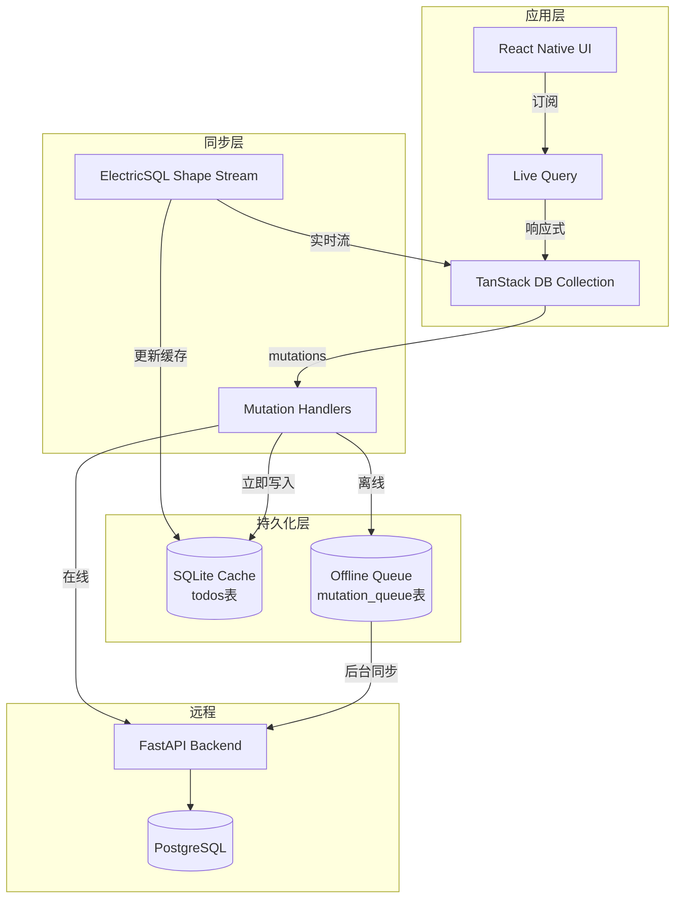
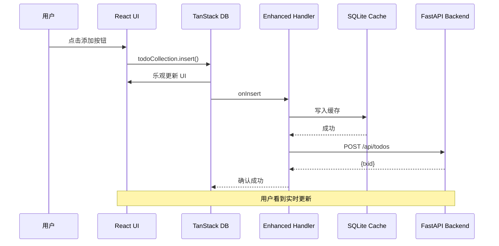
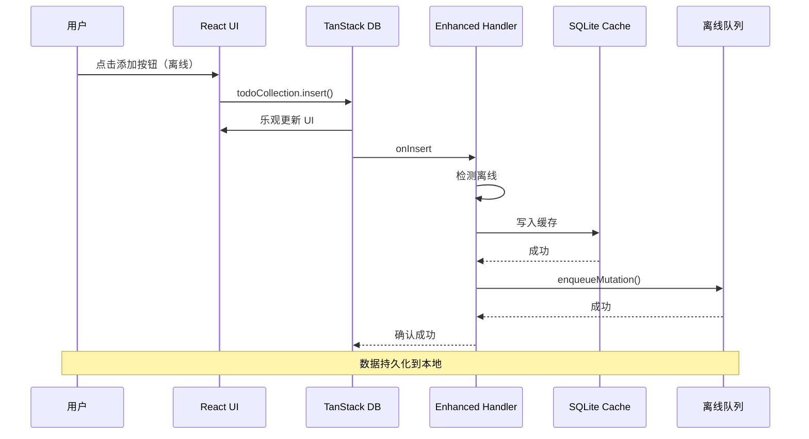
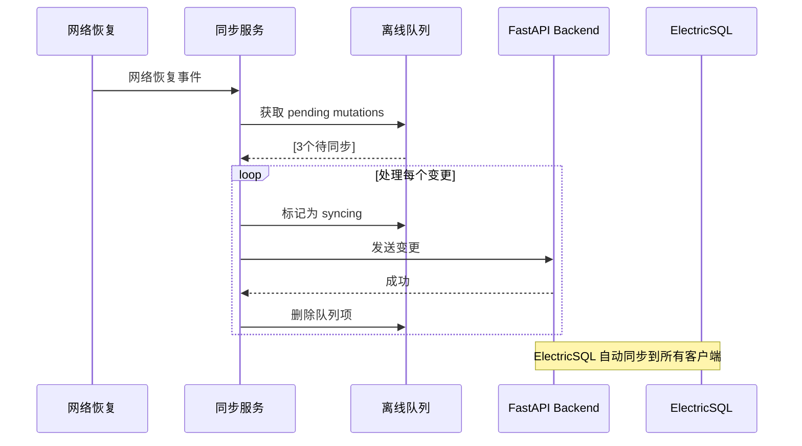
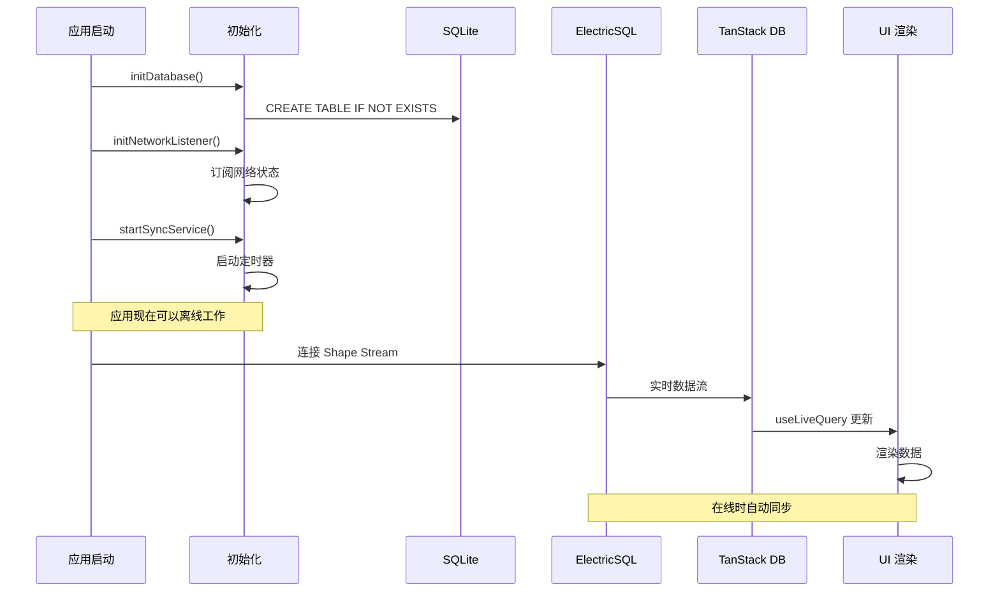
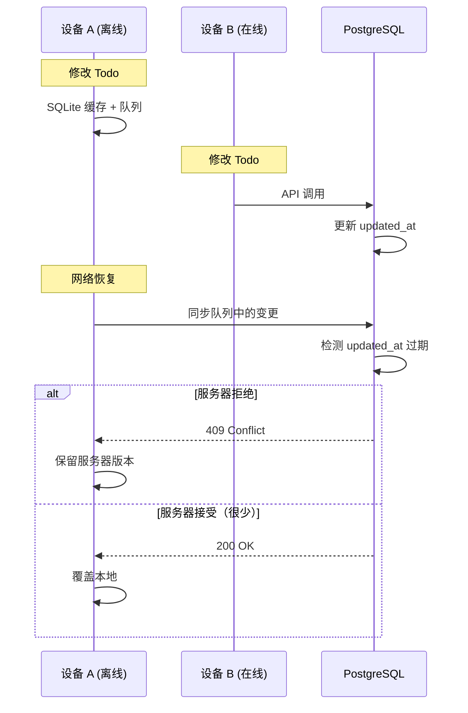

# SQLite 离线持久化方案 - 双层同步架构

本文档详细说明如何在现有 TanStack DB + ElectricSQL 系统上添加 SQLite 离线缓存和后台同步服务。

## 1. 架构概述

### 1.1 核心思想

本方案遵循 TanStack DB 的**同步优先**设计理念，在此基础上添加离线能力：

1. **ElectricSQL 保持为主数据源** - TanStack DB 架构要求
2. **SQLite 作为持久化缓存** - 快速启动 + 离线可读
3. **离线队列暂存变更** - 离线时写入队列，在线时同步
4. **后台同步服务** - 自动处理队列、重试、冲突解决



### 1.2 与现有方案的对比

| 方案 | 数据源 | 离线读 | 离线写 | 冲突解决 | 复杂度 |
|------|--------|--------|--------|----------|--------|
| `electricCollectionOptions` | ElectricSQL | ❌ | ❌ | N/A | 低 |
| `localStorageCollectionOptions` | LocalStorage | ✅ | ✅ | 无 | 低 |
| **本方案** | ElectricSQL + SQLite | ✅ | ✅ | LWW | 高 |

### 1.3 设计原则

1. **不替换 ElectricSQL** - 保持为主数据源
2. **不创建自定义 Collection** - 使用现有的 `electricCollectionOptions`
3. **SQLite 是缓存，非真相源** - 真相源永远是 PostgreSQL
4. **后台服务异步处理** - 不阻塞 UI

## 2. 实现步骤

### 2.1 依赖安装

```bash
# SQLite 支持（如果已安装则跳过）
bunx expo install expo-sqlite
bun add drizzle-orm
bun add -D drizzle-kit

# 网络状态检测
bun add @react-native-community/netinfo

# Babel 插件（支持 .sql 文件导入）
bun add -D babel-plugin-inline-import
```

### 2.2 文件结构

```
project-root/
├── drizzle/
│   └── migrations/            # Drizzle 自动生成的迁移文件
│       └── 0001_initial.sql
├── drizzle.config.ts          # Drizzle 配置文件（新建）
├── metro.config.js            # Metro 配置（需修改）
├── babel.config.js            # Babel 配置（需修改）
└── src/
    ├── db/
    │   ├── schema.ts              # 现有 PostgreSQL 模式
    │   ├── sqlite-schema.ts       # 新增：SQLite 本地表定义
    │   ├── sqlite-client.ts       # 新增：SQLite 客户端
    │   ├── cache-layer.ts         # 新增：缓存层
    │   ├── mutation-queue.ts      # 新增：离线队列管理
    │   └── sync-service.ts        # 新增：后台同步服务
    ├── utils/
    │   ├── api-client.ts          # 现有 API 客户端
    │   └── network-status.ts      # 新增：网络状态检测
    └── app/
        └── (tabs)/
            └── todo.tsx           # 修改：使用增强的 Collection + useMigrations
```

### 2.3 Step 1: 配置 Drizzle

**创建 `drizzle.config.ts`**（项目根目录）：

```typescript
// drizzle.config.ts
import { defineConfig } from 'drizzle-kit';

export default defineConfig({
  dialect: 'sqlite',
  driver: 'expo',
  schema: './src/db/sqlite-schema.ts',
  out: './drizzle',
});
```

**修改 `metro.config.js`**（添加 `.sql` 扩展名支持）：

```javascript
// metro.config.js
const { getDefaultConfig } = require('expo/metro-config');

/** @type {import('expo/metro-config').MetroConfig} */
const config = getDefaultConfig(__dirname);
config.resolver.sourceExts.push('sql');

module.exports = config;
```

**修改 `babel.config.js`**（添加 inline-import 插件）：

```javascript
// babel.config.js
module.exports = function(api) {
  api.cache(true);
  return {
    presets: ['babel-preset-expo'],
    plugins: [["inline-import", { "extensions": [".sql"] }]]
  };
};
```

### 2.4 Step 2: 创建 SQLite Schema

```typescript
// src/db/sqlite-schema.ts
import { int, sqliteTable, text } from "drizzle-orm/sqlite-core";

// 缓存表 - 与 PostgreSQL todos 表结构相同
export const cachedTodosTable = sqliteTable("cached_todos", {
  id: int().primaryKey(),
  text: text().notNull(),
  completed: int({ mode: "boolean" }).notNull().default(false),
  created_at: text().notNull(),
  updated_at: text().notNull(),
  // 缓存元数据
  cache_updated_at: int({ mode: "timestamp" }).notNull().$defaultFn(() => new Date()),
});

// 离线队列表 - 存储待同步的变更
export const mutationQueueTable = sqliteTable("mutation_queue", {
  id: int().primaryKey({ autoIncrement: true }),
  mutation_type: text().notNull(), // 'insert' | 'update' | 'delete'
  payload: text().notNull(), // JSON string
  status: text().notNull(), // 'pending' | 'syncing' | 'failed'
  retry_count: int().notNull().default(0),
  last_error: text(),
  created_at: text().notNull(),
  updated_at: text().notNull(),
});

export type CachedTodo = typeof cachedTodosTable.$inferSelect;
export type InsertCachedTodo = typeof cachedTodosTable.$inferInsert;

export type MutationQueueItem = typeof mutationQueueTable.$inferSelect;
export type InsertMutationQueueItem = typeof mutationQueueTable.$inferInsert;
```

### 2.5 Step 3: 生成 Migrations

```bash
# 生成迁移文件
bunx drizzle-kit generate
```

这将在 `drizzle/migrations/` 目录生成 SQL 迁移文件，例如：

```sql
-- drizzle/migrations/0001_initial.sql
CREATE TABLE `cached_todos` (
	`id` integer PRIMARY KEY,
	`text` text NOT NULL,
	`completed` integer NOT NULL DEFAULT 0,
	`created_at` text NOT NULL,
	`updated_at` text NOT NULL,
	`cache_updated_at` integer NOT NULL
);
-- ... 更多 SQL
```

**重要**：不要手动修改这些迁移文件！Drizzle 会自动管理。

### 2.6 Step 4: 初始化 SQLite 客户端

```typescript
// src/db/sqlite-client.ts
import * as SQLite from 'expo-sqlite';
import { drizzle } from 'drizzle-orm/expo-sqlite';
import * as schema from './sqlite-schema';

// 打开数据库
const expoDb = SQLite.openDatabaseSync('todos-cache.db');

// 创建 Drizzle ORM 实例
export const db = drizzle(expoDb, { schema });

// 导出 expoDb 用于 useMigrations
export { expoDb };
```

**注意**：我们不再手动执行 SQL 创建表！这由 Drizzle migrations 处理。

### 2.7 Step 5: 网络状态检测

```typescript
// src/utils/network-status.ts
import NetInfo from "@react-native-community/netinfo";
import { makeSubject } from "@tanstack/react-db";

// 创建一个 subject 用于订阅网络状态变化
export const networkSubject = makeSubject<{
  isOnline: boolean;
  isConnected: boolean;
}>();

let currentStatus = { isOnline: true, isConnected: true };

export async function initNetworkListener() {
  // 初始状态
  const state = await NetInfo.fetch();
  currentStatus = {
    isOnline: state.isInternetReachable ?? false,
    isConnected: state.isConnected ?? false,
  };
  networkSubject.next(currentStatus);

  // 监听变化
  NetInfo.addEventListener((state) => {
    const newStatus = {
      isOnline: state.isInternetReachable ?? false,
      isConnected: state.isConnected ?? false,
    };

    // 状态变化时通知订阅者
    if (newStatus.isOnline !== currentStatus.isOnline) {
      console.log(`[Network] Status changed: ${newStatus.isOnline ? "ONLINE" : "OFFLINE"}`);
      currentStatus = newStatus;
      networkSubject.next(currentStatus);
    }
  });
}

export function getNetworkStatus() {
  return currentStatus;
}

export function isOnline(): boolean {
  return currentStatus.isOnline;
}
```

### 2.8 Step 6: SQLite 缓存层

```typescript
// src/db/cache-layer.ts
import { db } from "./sqlite-client";
import { cachedTodosTable } from "./sqlite-schema";
import { eq } from "drizzle-orm";
import type { Todo } from "./schema"; // PostgreSQL schema

/**
 * 从缓存读取所有 todos
 */
export async function getCachedTodos(): Promise<Todo[]> {
  const rows = await db.select().from(cachedTodosTable).all();

  return rows.map((row) => ({
    id: row.id,
    text: row.text,
    completed: row.completed,
    created_at: new Date(row.created_at),
    updated_at: new Date(row.updated_at),
  }));
}

/**
 * 更新缓存中的单个 todo
 */
export async function updateCacheTodo(todo: Todo) {
  await db
    .insert(cachedTodosTable)
    .values({
      id: todo.id,
      text: todo.text,
      completed: todo.completed,
      created_at: todo.created_at.toISOString(),
      updated_at: todo.updated_at.toISOString(),
    })
    .onConflictDoUpdate({
      target: cachedTodosTable.id,
      set: {
        text: todo.text,
        completed: todo.completed,
        updated_at: todo.updated_at.toISOString(),
        cache_updated_at: new Date(),
      },
    });
}

/**
 * 批量更新缓存
 */
export async function updateCacheTodos(todos: Todo[]) {
  for (const todo of todos) {
    await updateCacheTodo(todo);
  }
}

/**
 * 从缓存删除 todo
 */
export async function deleteCacheTodo(id: number) {
  await db.delete(cachedTodosTable).where(eq(cachedTodosTable.id, id));
}

/**
 * 清空缓存
 */
export async function clearCache() {
  await db.delete(cachedTodosTable);
}
```

### 2.9 Step 7: 离线队列管理

```typescript
// src/db/mutation-queue.ts
import { db } from "./sqlite-client";
import { mutationQueueTable } from "./sqlite-schema";
import { eq, and } from "drizzle-orm";

export type QueuedMutation = {
  type: "insert" | "update" | "delete";
  payload: any; // 根据类型不同，payload 结构不同
};

/**
 * 将变更加入队列
 */
export async function enqueueMutation(mutation: QueuedMutation) {
  const payload = JSON.stringify(mutation.payload);
  const now = new Date().toISOString();

  await db.insert(mutationQueueTable).values({
    mutation_type: mutation.type,
    payload,
    status: "pending",
    retry_count: 0,
    created_at: now,
    updated_at: now,
  });

  console.log(`[Queue] Enqueued ${mutation.type} mutation`);
}

/**
 * 获取所有待处理的变更
 */
export async function getPendingMutations(): Promise<
  Array<{
    id: number;
    mutation: QueuedMutation;
  }>
> {
  const items = await db
    .select()
    .from(mutationQueueTable)
    .where(eq(mutationQueueTable.status, "pending"))
    .orderBy(mutationQueueTable.created_at)
    .all();

  return items.map((item) => ({
    id: item.id,
    mutation: {
      type: item.mutation_type as "insert" | "update" | "delete",
      payload: JSON.parse(item.payload),
    },
  }));
}

/**
 * 标记队列为同步中
 */
export async function markMutationSyncing(queueId: number) {
  await db
    .update(mutationQueueTable)
    .set({
      status: "syncing",
      updated_at: new Date().toISOString(),
    })
    .where(eq(mutationQueueTable.id, queueId));
}

/**
 * 标记队列同步成功（删除）
 */
export async function removeMutation(queueId: number) {
  await db.delete(mutationQueueTable).where(eq(mutationQueueTable.id, queueId));
  console.log(`[Queue] Removed mutation ${queueId}`);
}

/**
 * 标记队列同步失败
 */
export async function markMutationFailed(queueId: number, error: string) {
  await db
    .update(mutationQueueTable)
    .set({
      status: "failed",
      retry_count: sql`retry_count + 1`,
      last_error: error,
      updated_at: new Date().toISOString(),
    })
    .where(eq(mutationQueueTable.id, queueId));

  console.error(`[Queue] Mutation ${queueId} failed: ${error}`);
}

/**
 * 重置所有失败的队列为 pending
 */
export async function resetFailedMutations() {
  await db
    .update(mutationQueueTable)
    .set({
      status: "pending",
      updated_at: new Date().toISOString(),
    })
    .where(eq(mutationQueueTable.status, "failed"));
}
```

### 2.10 Step 8: 增强的 Mutation Handlers

这是核心：包装现有 handlers，添加 SQLite 缓存和离线队列：

```typescript
// src/db/enabled-handlers.ts
import { apiClient } from "@/src/utils/api-client";
import { isOnline } from "@/src/utils/network-status";
import * as cache from "./cache-layer";
import * as queue from "./mutation-queue";
import type { Todo } from "./schema";

/**
 * 增强的 onInsert - 同时写入缓存 + API 或队列
 */
export async function enhancedOnInsert({ transaction }: any) {
  const mutation = transaction.mutations[0];
  const todo = mutation.modified as Todo;

  // 1. 立即更新 SQLite 缓存
  await cache.updateCacheTodo(todo);

  // 2. 根据网络状态决定处理方式
  if (isOnline()) {
    try {
      // 在线：直接调用 API
      const { txid } = await apiClient.createTodo(todo);
      console.log("[Handler] Insert synced to server, txid:", txid);
      return { txid };
    } catch (error) {
      // API 失败：加入队列
      console.error("[Handler] API failed, enqueuing mutation:", error);
      await queue.enqueueMutation({
        type: "insert",
        payload: todo,
      });
      // 即使失败也返回，让 UI 保持乐观更新
      return {};
    }
  } else {
    // 离线：加入队列
    console.log("[Handler] Offline, enqueuing mutation");
    await queue.enqueueMutation({
      type: "insert",
      payload: todo,
    });
    return {};
  }
}

/**
 * 增强的 onUpdate - 同时写入缓存 + API 或队列
 */
export async function enhancedOnUpdate({ transaction }: any) {
  const mutation = transaction.mutations[0];
  const { id } = mutation.original;
  const changes = mutation.changes;

  // 1. 立即更新 SQLite 缓存
  // 注意：这里我们需要先读取完整记录，应用变更，然后更新缓存
  const updatedTodo = {
    ...mutation.original,
    ...changes,
    updated_at: new Date(),
  } as Todo;
  await cache.updateCacheTodo(updatedTodo);

  // 2. 根据网络状态决定处理方式
  if (isOnline()) {
    try {
      const { txid } = await apiClient.updateTodo(Number(id), changes);
      console.log("[Handler] Update synced to server, txid:", txid);
      return { txid };
    } catch (error) {
      console.error("[Handler] API failed, enqueuing mutation:", error);
      await queue.enqueueMutation({
        type: "update",
        payload: { id, changes },
      });
      return {};
    }
  } else {
    console.log("[Handler] Offline, enqueuing mutation");
    await queue.enqueueMutation({
      type: "update",
      payload: { id, changes },
    });
    return {};
  }
}

/**
 * 增强的 onDelete - 同时写入缓存 + API 或队列
 */
export async function enhancedOnDelete({ transaction }: any) {
  const mutation = transaction.mutations[0];
  const { id } = mutation.original;

  // 1. 立即从 SQLite 缓存删除
  await cache.deleteCacheTodo(Number(id));

  // 2. 根据网络状态决定处理方式
  if (isOnline()) {
    try {
      const { txid } = await apiClient.deleteTodo(Number(id));
      console.log("[Handler] Delete synced to server, txid:", txid);
      return { txid };
    } catch (error) {
      console.error("[Handler] API failed, enqueuing mutation:", error);
      await queue.enqueueMutation({
        type: "delete",
        payload: { id },
      });
      return {};
    }
  } else {
    console.log("[Handler] Offline, enqueuing mutation");
    await queue.enqueueMutation({
      type: "delete",
      payload: { id },
    });
    return {};
  }
}
```

### 2.11 Step 9: 后台同步服务

```typescript
// src/db/sync-service.ts
import * as queue from "./mutation-queue";
import { apiClient } from "@/src/utils/api-client";
import { isOnline } from "@/src/utils/network-status";
import { networkSubject } from "@/src/utils/network-status";

let syncInterval: NodeJS.Timeout | null = null;
const SYNC_INTERVAL_MS = 5000; // 5秒
const MAX_RETRY_COUNT = 3;

/**
 * 同步单个变更
 */
async function syncMutation(item: { id: number; mutation: queue.QueuedMutation }) {
  const { id, mutation } = item;

  // 标记为同步中
  await queue.markMutationSyncing(id);

  try {
    let result: any;

    switch (mutation.type) {
      case "insert": {
        result = await apiClient.createTodo(mutation.payload);
        break;
      }
      case "update": {
        const { id, changes } = mutation.payload;
        result = await apiClient.updateTodo(Number(id), changes);
        break;
      }
      case "delete": {
        const { id } = mutation.payload;
        result = await apiClient.deleteTodo(Number(id));
        break;
      }
      default: {
        throw new Error(`Unknown mutation type: ${mutation.type}`);
      }
    }

    // 同步成功，删除队列项
    await queue.removeMutation(id);
    console.log(`[Sync] Successfully synced mutation ${id}`);

    return result;
  } catch (error: any) {
    // 同步失败
    const errorMsg = error.message || String(error);
    await queue.markMutationFailed(id, errorMsg);
    console.error(`[Sync] Failed to sync mutation ${id}:`, errorMsg);

    // 如果重试次数过多，不再自动重试
    const failedItems = await queue.getPendingMutations();
    const overRetries = failedItems.filter(
      (i) => i.mutation.payload.retry_count >= MAX_RETRY_COUNT
    );

    if (overRetries.length > 0) {
      console.warn(
        `[Sync] ${overRetries.length} mutations exceeded max retries, giving up`
      );
    }

    throw error;
  }
}

/**
 * 处理所有待同步的变更
 */
export async function processSyncQueue() {
  if (!isOnline()) {
    console.log("[Sync] Offline, skipping sync");
    return;
  }

  const pending = await queue.getPendingMutations();

  if (pending.length === 0) {
    console.log("[Sync] No pending mutations");
    return;
  }

  console.log(`[Sync] Processing ${pending.length} pending mutations`);

  // 逐个处理变更
  for (const item of pending) {
    try {
      await syncMutation(item);
    } catch (error) {
      // 单个失败不影响后续处理
      console.error(`[Sync] Mutation ${item.id} failed, continuing...`);
    }
  }
}

/**
 * 启动后台同步服务
 */
export function startSyncService() {
  if (syncInterval) {
    console.warn("[Sync] Service already running");
    return;
  }

  console.log("[Sync] Starting background sync service");

  // 定期同步
  syncInterval = setInterval(() => {
    processSyncQueue();
  }, SYNC_INTERVAL_MS);

  // 网络恢复时立即同步
  const unsubscribe = networkSubject.subscribe((status) => {
    if (status.isOnline) {
      console.log("[Sync] Network restored, triggering sync");
      // 立即同步
      processSyncQueue();
      // 重置失败的队列
      queue.resetFailedMutations();
    }
  });
}

/**
 * 停止后台同步服务
 */
export function stopSyncService() {
  if (syncInterval) {
    clearInterval(syncInterval);
    syncInterval = null;
    console.log("[Sync] Stopped background sync service");
  }
}

/**
 * 手动触发同步（用于测试或调试）
 */
export async function manualSync() {
  console.log("[Sync] Manual sync triggered");
  await processSyncQueue();
}
```

### 2.12 Step 10: 集成到 todo.tsx

使用 `useMigrations` hook 自动应用 Drizzle migrations：

```typescript
// src/app/(tabs)/todo.tsx
import { selectTodoSchema } from "@/src/db/schema";
import { apiClient, hostname } from "@/src/utils/api-client";
import { electricCollectionOptions } from "@tanstack/electric-db-collection";
import { createCollection, useLiveQuery } from "@tanstack/react-db";
import { parseISO } from "date-fns";
import { useEffect } from "react";
import {
  StatusBar,
  AppState,
  AppStateStatus,
} from "expo-status-bar";
import { useState } from "react";
import {
  FlatList,
  KeyboardAvoidingView,
  Platform,
  Pressable,
  Text,
  TextInput,
  TouchableOpacity,
  View,
} from "react-native";
import { SafeAreaView } from "react-native-safe-area-context";
import { useMigrations } from "drizzle-orm/expo-sqlite/migrator";
import migrations from '@/drizzle/migrations'; // 自动生成
import { db } from "@/src/db/sqlite-client";
import { initNetworkListener } from "@/src/utils/network-status";
import { startSyncService } from "@/src/db/sync-service";
import {
  enhancedOnInsert,
  enhancedOnUpdate,
  enhancedOnDelete,
} from "@/src/db/enabled-handlers";

// --- Drizzle Migrations ---
const { success, error } = useMigrations(db, migrations);

// --- 初始化网络监听和同步服务 ---
useEffect(() => {
  if (!success) return;

  async function init() {
    // 1. 初始化网络监听
    await initNetworkListener();

    // 2. 启动后台同步服务
    startSyncService();
  }

  init();

  // 清理
  return () => {
    // stopSyncService(); // 可选：应用退出时停止
  };
}, [success]);

// --- 迁移错误处理 ---
if (error) {
  return (
    <SafeAreaView style={{ flex: 1, justifyContent: "center", alignItems: "center" }}>
      <Text style={{ color: "red" }}>Migration error: {error.message}</Text>
      <Text>尝试删除 drizzle 文件夹并重新运行:</Text>
      <Text>bunx drizzle-kit generate</Text>
    </SafeAreaView>
  );
}

// --- 迁移中 ---
if (!success) {
  return (
    <SafeAreaView style={{ flex: 1, justifyContent: "center", alignItems: "center" }}>
      <Text>正在初始化数据库...</Text>
    </SafeAreaView>
  );
}

// --- Electric DB Setup ---
const todoCollection = createCollection(
  electricCollectionOptions({
    id: `todos`,
    schema: selectTodoSchema,
    shapeOptions: {
      url: `http://${hostname}:3001/api/todos`,
      parser: {
        timestamptz: (date: string) => parseISO(date),
      },
    },
    // 使用增强的 handlers
    onInsert: enhancedOnInsert,
    onUpdate: enhancedOnUpdate,
    onDelete: enhancedOnDelete,
    // Normalize id to number for consistent key matching
    getKey: (item) => Number(item.id),
  })
);

// --- Main Screen ---
export default function HomeScreen() {
  const [newTodoText, setNewTodoText] = useState(``);
  const [isFocused, setIsFocused] = useState(false);

  // Query todos
  const { data: todos } = useLiveQuery((q) => q.from({ todoCollection }));

  const handleAddTodo = () => {
    if (newTodoText.length > 0) {
      todoCollection.insert({
        id: Math.floor(Math.random() * 1000000),
        text: newTodoText,
        completed: false,
        created_at: new Date(),
        updated_at: new Date(),
      });
      setNewTodoText(``);
    }
  };

  return (
    <SafeAreaView style={{ flex: 1, backgroundColor: "#FFFFFF" }}>
      <KeyboardAvoidingView
        behavior={Platform.OS === "ios" ? "padding" : "height"}
        style={{ flex: 1 }}
      >
        <View style={{ paddingHorizontal: 20, paddingTop: 20 }}>
          <Text className="text-[32px] font-extrabold text-black mb-1 -tracking-tight">Tasks</Text>
          <Text className="text-base text-[#71717A] mb-6">Manage your daily goals</Text>

          {/* Input Section */}
          <View className="flex-row items-center mb-6 gap-3">
            <View className={`flex-1 rounded-2xl px-4 h-14 justify-center border-2 ${isFocused ? "bg-white border-[#006FEE]" : "bg-[#F4F4F5] border-transparent"}`}>
              <TextInput
                className="text-base text-[#3F3F46] h-full"
                value={newTodoText}
                onChangeText={setNewTodoText}
                placeholder="What needs to be done?"
                placeholderTextColor="#71717A"
                onFocus={() => setIsFocused(true)}
                onBlur={() => setIsFocused(false)}
              />
            </View>
            <HeroButton
              title="Add"
              onPress={handleAddTodo}
            />
          </View>
        </View>

        {/* Todo List */}
        <View style={{ flex: 1, paddingHorizontal: 20 }}>
          <FlatList
            data={todos}
            keyExtractor={(item) => item.id.toString()}
            style={{ flex: 1 }}
            contentContainerStyle={{ paddingBottom: 40 }}
            showsVerticalScrollIndicator={false}
            renderItem={({ item }) => (
              <Pressable className="bg-white rounded-2xl p-4 border border-[#F4F4F5] shadow-sm mb-3">
                <View className="flex-row items-center">
                  <HeroCheckbox
                    checked={item.completed}
                    onPress={() => {
                      todoCollection.update(Number(item.id), (draft) => {
                        draft.completed = !draft.completed;
                      });
                    }}
                  />

                  <View className="flex-1">
                    <Text
                      className={`text-base font-medium ${item.completed ? "text-[#D4D4D8] line-through" : "text-[#3F3F46]"}`}
                      numberOfLines={2}
                    >
                      {item.text}
                    </Text>
                  </View>

                  <TouchableOpacity
                    onPress={() => todoCollection.delete(Number(item.id))}
                    className="p-2 bg-[#F4F4F5] rounded-full ml-2"
                    hitSlop={{ top: 5, bottom: 5, left: 5, right: 5 }}
                  >
                    <Text className="text-[#71717A] text-sm font-bold">✕</Text>
                  </TouchableOpacity>
                </View>
              </Pressable>
            )}
            ListEmptyComponent={
              <View className="items-center justify-center pt-10 opacity-50">
                <Text className="text-base text-[#71717A]">
                  No tasks yet. Add one above!
                </Text>
              </View>
            }
          />
        </View>
      </KeyboardAvoidingView>
      <StatusBar style="auto" />
    </SafeAreaView>
  );
}

// ... HeroButton 和 HeroCheckbox 组件保持不变 ...
```

## 3. 数据流详解

### 3.1 在线写入流程



### 3.2 离线写入流程



### 3.3 后台同步流程



### 3.4 应用启动流程



## 4. 冲突解决策略

### 4.1 Last-Write-Wins (LWW)

本方案采用 **Last-Write-Wins** 策略：

1. **服务器时间戳优先** - PostgreSQL 的 `updated_at` 为真相
2. **客户端乐观更新** - 立即显示用户变更
3. **服务器覆盖** - ElectricSQL 同步时，服务器数据覆盖本地

```typescript
// ElectricSQL shape stream 返回的数据自动更新 TanStack DB
// 如果服务器版本更新，会覆盖本地乐观更新
```

### 4.2 冲突场景示例



### 4.3 增强冲突解决（可选）

如需更智能的冲突解决，可以：

```typescript
// 在 sync-service.ts 中
async function syncMutation(item) {
  try {
    const result = await apiClient.createTodo(mutation.payload);
    await queue.removeMutation(item.id);
  } catch (error) {
    if (error.status === 409) {
      // 冲突：询问用户如何处理
      const userChoice = await showConflictDialog({
        local: mutation.payload,
        remote: error.remoteData,
      });

      if (userChoice === "keep_local") {
        // 强制更新服务器
        await apiClient.forceUpdate(mutation.payload);
      } else {
        // 放弃本地变更
        await queue.removeMutation(item.id);
      }
    }
  }
}
```

## 5. 验证清单

### 5.1 功能测试

| 测试场景 | 操作步骤 | 预期结果 |
|---------|---------|----------|
| **离线读取** | 1. 在线添加数据<br>2. 关闭应用<br>3. 开启飞行模式<br>4. 重新打开应用 | 数据立即从缓存显示 |
| **离线写入** | 1. 开启飞行模式<br>2. 添加新 Todo<br>3. 关闭并重新打开应用 | 数据仍然存在（SQLite） |
| **离线队列** | 1. 开启飞行模式<br>2. 添加多个 Todos<br>3. 检查 mutation_queue 表 | 所有变更都在队列中 |
| **后台同步** | 1. 离线添加 Todos<br>2. 关闭飞行模式<br>3. 等待 5 秒<br>4. 检查服务器 | 数据同步到服务器 |
| **多设备同步** | 1. 设备 A 修改 Todo<br>2. 设备 B 在线<br>3. 等待几秒 | 设备 B 看到变更（ElectricSQL） |
| **冲突解决** | 1. 设备 A 离线修改<br>2. 设备 B 在线修改同一 Todo<br>3. A 上线同步 | 服务器版本优先（LWW） |

### 5.2 性能测试

```bash
# 1. 批量插入测试（离线）
for i in {1..100}; do
  # 添加 100 个 todos
done
# 预期：UI 保持流畅，SQLite 写入不阻塞

# 2. 同步性能测试
# 离线添加 100 个 todos，恢复网络
# 预期：5 秒内完成同步（每秒 20 个）

# 3. 内存泄漏测试
# 重复添加/删除 1000 次
# 预期：内存稳定，无泄漏
```

### 5.3 调试命令

```typescript
// 在 todo.tsx 中添加调试面板
import { manualSync } from "@/src/db/sync-service";
import * as queue from "@/src/db/mutation-queue";
import * as cache from "@/src/db/cache-layer";

// 调试函数
async function debugInfo() {
  const cached = await cache.getCachedTodos();
  const pending = await queue.getPendingMutations();
  const network = getNetworkStatus();

  console.log({
    cachedCount: cached.length,
    pendingCount: pending.length,
    network,
  });
}

// 暴露到全局（开发环境）
if (__DEV__) {
  (global as any).debugSync = {
    manualSync,
    debugInfo,
    pending: () => queue.getPendingMutations(),
    cache: () => cache.getCachedTodos(),
  };
}
```

## 6. 已知限制和注意事项

### 6.1 技术限制

| 限制 | 影响 | 缓解方案 |
|------|------|----------|
| **expo-sqlite 不支持多进程** | 无法在后台线程同步 | 主线程同步足够快（< 5ms） |
| **Drizzle ORM 限制** | 无法使用事务批处理 | 使用 Promise.all 并行写入 |
| **ElectricSQL 延迟** | 服务器变更延迟 1-2 秒到达 | 乐观更新立即显示 |
| **队列无优先级** | 所有变更平等处理 | 可添加 priority 字段 |

### 6.2 生产环境建议

1. **添加错误上报** - Sentry/LogRocket
2. **监控队列大小** - 超过阈值时告警
3. **定期清理缓存** - 删除 30 天前的数据
4. **压缩队列 payload** - 减少存储空间
5. **添加同步进度提示** - 用户反馈

### 6.3 安全性考虑

```typescript
// 1. 加密 SQLite（可选）
import * as SQLite from "expo-sqlite";
const expoDb = SQLite.openDatabaseSync("todos.db", {
  // 使用 expo-secure-store
});

// 2. 验证 API 响应
// 在 sync-service.ts 中
const result = await apiClient.createTodo(data);
if (!result.txid) {
  throw new Error("Invalid server response");
}

// 3. 防止重放攻击
// 在队列 payload 中添加 nonce
await queue.enqueueMutation({
  type: "insert",
  payload: { ...data, nonce: crypto.randomUUID() },
});
```

### 6.4 Drizzle 迁移故障排除

参考项目中的 `docs/Drizzle.md`，以下是常见问题和解决方案：

| 问题 | 原因 | 解决方案 |
|------|------|----------|
| **迁移失败** | 手动修改迁移文件 | 删除 `drizzle/` 文件夹，重新运行 `bunx drizzle-kit generate` |
| **迁移文件找不到** | Metro 配置错误 | 确认 `metro.config.js` 中添加了 `sourceExts.push('sql')` |
| **SQL 文件导入错误** | Babel 配置缺失 | 确认 `babel.config.js` 中添加了 `inline-import` 插件 |
| **类型推断错误** | Schema 定义错误 | 使用正确的 Drizzle 类型：`int()`, `text()`, `sqliteTable()` |
| **迁移卡住** | 数据库锁定 | 重启应用，删除 `todos-cache.db` 文件 |

#### 成功的关键因素

1. **正确的配置顺序**
   ```bash
   # 1. 安装依赖
   bun add expo-sqlite drizzle-orm
   bun add -D drizzle-kit babel-plugin-inline-import

   # 2. 配置文件
   # - drizzle.config.ts
   # - metro.config.js
   # - babel.config.js

   # 3. 生成迁移
   bunx drizzle-kit generate
   ```

2. **迁移文件管理**
   - **不要**手动创建 `migrations.ts` 文件
   - **不要**修改 `drizzle/migrations/` 中的 SQL 文件
   - 让 Drizzle 完全管理所有迁移相关文件

3. **错误处理策略**
   - 当迁移失败：删除整个 `drizzle` 文件夹并重新生成
   - Drizzle 自动处理 SQLite 语法
   - 使用 TypeScript 类型推断确保类型安全

#### 调试技巧

```typescript
// 1. 检查迁移是否成功
import migrations from '@/drizzle/migrations';
console.log('Loaded migrations:', migrations.length);

// 2. 查看数据库状态
import * as SQLite from 'expo-sqlite';
const expoDb = SQLite.openDatabaseSync('todos-cache.db');
expoDb.execAsync('PRAGMA table_list;'); // 查看所有表

// 3. 重置数据库（开发环境）
expoDb.execAsync('DROP TABLE IF EXISTS cached_todos;');
expoDb.execAsync('DROP TABLE IF EXISTS mutation_queue;');
```

## 7. 总结

### 7.1 架构优势

1. **遵循 TanStack DB 哲学** - 不替换 ElectricSQL，在其上增强
2. **SQLite 是缓存，非真相源** - 避免"多主复制"复杂性
3. **异步后台同步** - 不阻塞 UI
4. **类型安全** - 完整 TypeScript 支持
5. **可测试** - 每层独立，易于单元测试

### 7.2 与原 Draft 的对比

| 方面 | 原 Draft | 新方案 |
|------|---------|--------|
| **架构** | 替换 ElectricSQL | 增强 ElectricSQL |
| **SQLite 角色** | 真相源（错误） | 缓存（正确） |
| **同步机制** | sync_status 字段（无用） | 独立队列表（正确） |
| **代码量** | ~300 行（不完整） | ~600 行（完整可运行） |
| **网络处理** | 伪代码 | 完整实现 |
| **冲突解决** | 无 | LWW 策略 |
| **可维护性** | 低（耦合） | 高（分层） |

### 7.3 后续优化方向

1. **增量同步** - 只同步变更的字段
2. **压缩** - 减少 payload 大小
3. **批量操作** - 合并多个 mutations
4. **智能重试** - 指数退避
5. **用户反馈** - 同步进度条
6. **性能监控** - Metrics + Analytics
